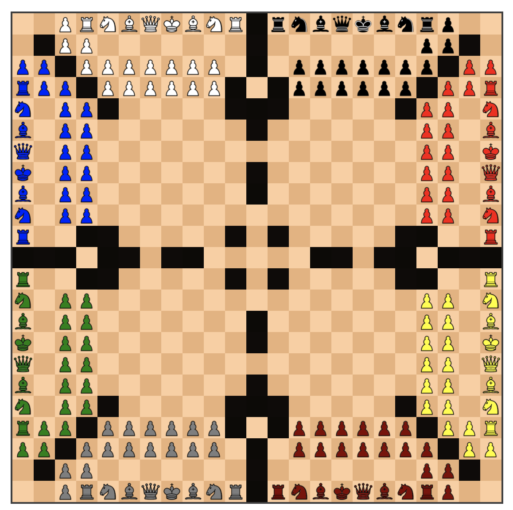
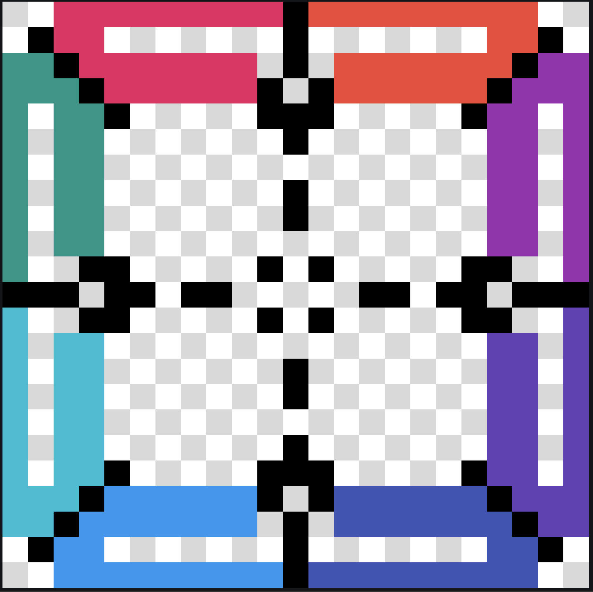

# Commit Chess


It's `M`-player, `N`x`N` chess!  `M` and `N` are _theoretically_ arbitrary, but the code is a bit of a minefield, so theory may not meet practice here.  If you're willing to read a bit, maps are fully customizable.  It even has a messaging system, for some reason!<sup>1</sup>

## Design
In this variant, there are some notable deviations from standard chess:
- There's no castling
- There's no en passant capture
- There's no pawn promotion
- Pawns can move in any cardinal direction and capture in any ordinal direction (they may still move two spaces when opening)
- Players are eliminated by checkmating them; when they're eliminated, their pieces remain (and can be used as shelter!)
- There are walls (the black squares); ya can't go through 'em

Walls are perhaps the most interesting deviation.
Quickly after getting something working with more than 2 players, I realized the state space for players to reason in quickly becomes too large, unless you prune it somehow.  The hope is that walls make local reasoning tractable, so in the bottom-left of the board, you don't need to worry about somebody's bishop flying down from the top-right and capturing your queen.

## Running
It's using [Node.js](https://nodejs.org/en/), so as long as you have [npm](https://www.npmjs.com/get-npm) installed,
just do `npm start` and it'll open on port 3000.

To make your server accessible to the Internet,
install [Localtunnel](https://localtunnel.github.io/www/),
then run `open_tunnel.sh` in this repo.  It'll spit out a link you can share with friends.  Once enough players have joined (8 players in the default map), the match will automatically begin.

## Code Walkthrough
Gonna be honest.  The code is straight-up garbage.  Inconsistent style.  Stringly-typed.  Trusts clients and uses the server as a move router.  Y'know.  The works.

That being said, if you're willing to trudge through, these are the most important files:
- [chess.js](./node_modules/chess.js/chess.js): The implementation of M-player, NxN chess.
- [chessboard.js](./public/js/chessboard.js): The visual counterpart to [chess.js](./node_modules/chess.js/chess.js). Handles board rendering, piece dragging, piece animation, move highlighting, etc.
- [client.js](./public/js/client.js): Facilitates single-player games and handles the client code for multi-player games.
- [server.js](./src/server.js): Keeps track of connected users and how many users are in a room.  Broadcasts moves and messages from each client to the other clients.

## Map Generation
Oh, boy.  This is a little gross, but also kind of a neat trick that old-school game devs use to hack in level editors.

The way boards are ultimately encoded is as follows:
```
// 8-player WTF
  const START_POSITION = [
    ['', '', 'p0', 'r0', 'n0', 'b0', 'q0', 'k0', 'b0', 'n0', 'r0', 'x', 'r1', 'n1', 'b1', 'q1', 'k1', 'b1', 'n1', 'r1', 'p1', '', ''],
    ['', 'x', 'p0', 'p0', '', '', '', '', '', '', '', 'x', '', '', '', '', '', '', '', 'p1', 'p1', 'x', ''],
    ['p2', 'p2', 'x', 'p0', 'p0', 'p0', 'p0', 'p0', 'p0', 'p0', '', 'x', '', 'p1', 'p1', 'p1', 'p1', 'p1', 'p1', 'p1', 'x', 'p3', 'p3'],
    ['r2', 'p2', 'p2', 'x', 'p0', 'p0', 'p0', 'p0', 'p0', 'p0', 'x', '', 'x', 'p1', 'p1', 'p1', 'p1', 'p1', 'p1', 'x', 'p3', 'p3', 'r3'],
    ['n2', '', 'p2', 'p2', 'x', '', '', '', '', '', 'x', 'x', 'x', '', '', '', '', '', 'x', 'p3', 'p3', '', 'n3'],
    ['b2', '', 'p2', 'p2', '', '', '', '', '', '', '', 'x', '', '', '', '', '', '', '', 'p3', 'p3', '', 'b3'],
    ['q2', '', 'p2', 'p2', '', '', '', '', '', '', '', '', '', '', '', '', '', '', '', 'p3', 'p3', '', 'k3'],
    ['k2', '', 'p2', 'p2', '', '', '', '', '', '', '', 'x', '', '', '', '', '', '', '', 'p3', 'p3', '', 'q3'],
    ['b2', '', 'p2', 'p2', '', '', '', '', '', '', '', 'x', '', '', '', '', '', '', '', 'p3', 'p3', '', 'b3'],
    ['n2', '', 'p2', 'p2', '', '', '', '', '', '', '', '', '', '', '', '', '', '', '', 'p3', 'p3', '', 'n3'],
    ['r2', '', '', 'x', 'x', '', '', '', '', '', 'x', '', 'x', '', '', '', '', '', 'x', 'x', '', '', 'r3'],
    ['x', 'x', 'x', '', 'x', 'x', '', 'x', 'x', '', '', '', '', '', 'x', 'x', '', 'x', 'x', '', 'x', 'x', 'x'],
    ['r4', '', '', 'x', 'x', '', '', '', '', '', 'x', '', 'x', '', '', '', '', '', 'x', 'x', '', '', 'r5'],
    ['n4', '', 'p4', 'p4', '', '', '', '', '', '', '', '', '', '', '', '', '', '', '', 'p5', 'p5', '', 'n5'],
    ['b4', '', 'p4', 'p4', '', '', '', '', '', '', '', 'x', '', '', '', '', '', '', '', 'p5', 'p5', '', 'b5'],
    ['k4', '', 'p4', 'p4', '', '', '', '', '', '', '', 'x', '', '', '', '', '', '', '', 'p5', 'p5', '', 'k5'],
    ['q4', '', 'p4', 'p4', '', '', '', '', '', '', '', '', '', '', '', '', '', '', '', 'p5', 'p5', '', 'q5'],
    ['b4', '', 'p4', 'p4', '', '', '', '', '', '', '', 'x', '', '', '', '', '', '', '', 'p5', 'p5', '', 'b5'],
    ['n4', '', 'p4', 'p4', 'x', '', '', '', '', '', 'x', 'x', 'x', '', '', '', '', '', 'x', 'p5', 'p5', '', 'n5'],
    ['r4', 'p4', 'p4', 'x', 'p6', 'p6', 'p6', 'p6', 'p6', 'p6', 'x', '', 'x', 'p7', 'p7', 'p7', 'p7', 'p7', 'p7', 'x', 'p5', 'p5', 'r5'],
    ['p4', 'p4', 'x', 'p6', 'p6', 'p6', 'p6', 'p6', 'p6', 'p6', '', 'x', '', 'p7', 'p7', 'p7', 'p7', 'p7', 'p7', 'p7', 'x', 'p5', 'p5'],
    ['', 'x', 'p6', 'p6', '', '', '', '', '', '', '', 'x', '', '', '', '', '', '', '', 'p7', 'p7', 'x', ''],
    ['', '', 'p6', 'r6', 'n6', 'b6', 'q6', 'k6', 'b6', 'n6', 'r6', 'x', 'r7', 'n7', 'b7', 'k7', 'q7', 'b7', 'n7', 'r7', 'p7', '', '']
  ]
```
You can find a whole graveyard of map definitions written this way in [chess.js](./node_modules/chess.js/chess.js), and whichever one is uncommented, is the one that will be used when the server starts.

But writing maps out this way is a PITA, even with Vim.  One trick game devs use (especially during game jams) is to use image editors as level editors.  So the map above is edited in [Pixil](https://www.pixilart.com/draw) and looks like this:


You can use any colors you like for each player, as long as they're distinct.  The type of the piece is encoded by the layer you draw on, so every valid `.pixil` file should have the following layers:
```
pawns
knights
bishops
rooks
queens
kings
walls
```
The color doesn't matter for the `walls` layer.

There are example `.pixil` files in the `maps` folder, along with a script `gen_map_from_pixel.py` that will parse a given Pixil file  to the "`const START_POSITION = [...]`" business.  Then you have to copy that and paste it into [chess.js](./node_modules/chess.js/chess.js).  Yeah... not optimal.  Here's an example run:
```bash
python gen_map_from_pixel.py 8-player-arena-v3.pixil
```

## Limitations/TODOs
- There's no support for rejoining games
- The 8-player map needs a smaller variant, so it doesn't take so long for the game to get interesting
- With >2 players, some kind of move timer would help speed up the game.  The idea would be that when the time goes out, the player is forced to make a random move.  Start it at 5-10 seconds, then as more players are eliminated, give more time to the remaining players.

## Acknowledgements
**Huge** thanks to [kansalanmol0609](https://github.com/kansalanmol0609) for providing the [2-player, 8x8 implementation](https://github.com/kansalanmol0609/Online-Multiplayer-Chess) that I was able to generalize and build upon.

## Footnotes
1: The messaging system came from the parent repository
